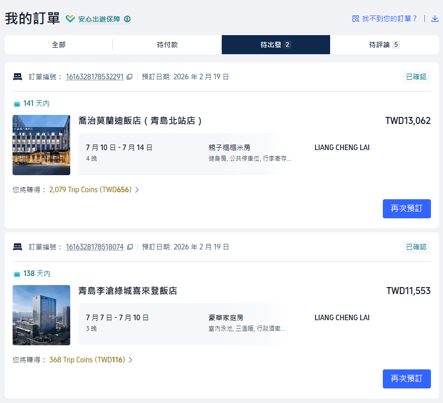

# 青島八日行程規劃（7/7-7/14）

> **上次更新**：2026/02/20（v2 — 以交通時間為第一考量重新規劃）
>
> **住宿**（已訂 ✅）：
> - 7/7-7/10（三晚）：青島李滄綠城喜來登飯店 — 豪華家庭房，TWD 11,553
> - 7/10-7/14（四晚）：喬治莫蘭迪飯店（青島北站店）— 親子榻榻米房，TWD 13,062
> - 住宿合計：**TWD 24,615**
>
> **人數**：5 人（48、48、15、13、8 歲）
> **原則**：每段交通 < 1 小時；考量 8 歲幼童體力；每日景點上限 2-3 個
> **策略**：兩間飯店均在李滄區（李村站周邊），優先安排飯店附近景點（世博園、百果山、滄口公園等）。長距離通勤日（單程 > 40 分鐘）僅 2 天：嶗山北九水、老城區

---

## 住宿詳情

### 1. 青島李滄綠城喜來登飯店（7/7-7/10，三晚）

- **狀態**：已確認（訂單編號 1616328178518074，2026/02/19 預訂）
- **房型**：豪華家庭房（室內泳池、三溫暖、行政酒廊）
- **總價**：TWD 11,553（每晚 TWD 3,851）
- **評分**：Marriott 國際品牌
- **地點**：李滄區，李村地鐵站旁（地鐵 2/3 號線交匯）
- **連結**：https://tw.trip.com/hotels/detail/?cityId=7&hotelId=840717&checkIn=2026-07-07&checkOut=2026-07-10&adult=3&children=0&crn=1&rooms=1&curr=TWD

### 2. 喬治莫蘭迪飯店（青島北站店）（7/10-7/14，四晚）

- **狀態**：已確認（訂單編號 1616328178532291，2026/02/19 預訂）
- **房型**：親子榻榻米房（健身房、公共停車位、行李寄存）
- **總價**：TWD 13,062（每晚 TWD 3,266）
- **評分**：9.7/10（1,020 則評論）
- **地點**：李滄區，李村地鐵站附近（地鐵 3 號線 1 站）
- **連結**：https://tw.trip.com/hotels/detail/?cityId=7&hotelId=121763688&checkIn=2026-07-10&checkOut=2026-07-14&adult=3&children=0&crn=1&rooms=1&curr=TWD

> **住宿總費用**：TWD 11,553 + TWD 13,062 = **TWD 24,615**（七晚）

**出發前確認**：
- [ ] 確認入住/退房時間
- [ ] 確認是否需要加床

---

## 行程大總表（方案 A / B / C）

> **三種方案**：
> - **A 豪華版** = B + 全部備案（方特 ★、海底世界、極地海洋公園 ★）
> - **B 標準版** = v1 原版行程
> - **C 輕裝版** = v2 修正行程（✅ 推薦 — 通勤最短）
>
> 門票：全家 5 人合計（TWD）。★ = 按身高收費。⚠️ = v1 未驗證交通估計。

| 日期 | 方案 | 景點/活動 | 交通方式 | 當日交通 | 門票 |
|------|:----:|----------|----------|----------|------|
| **7/7 (二)** | AB | 抵達 → 飯店晚餐 | 計程車 43km | 45 分 ⚠️ | — |
| | C | 抵達 → 李村夜市 | 計程車 43km + 步行 | 55 分 | — |
| **7/8 (三)** | AB | 棧橋→大教堂→海軍博物館→八大關→海水浴場 | 地鐵 3 號線 ⚠️ | 2 時 11 分 ⚠️ | $289 |
| | C | 世博園 + 百果山百樂園 ★ | 計程車 12km | 45 分 | $1,733 |
| **7/9 (四)** | AB | 嶗山北九水 | 地鐵 2→11 號線 ⚠️ | 1 時 30 分 ⚠️ | $1,350 |
| | C | 嶗山北九水 | 計程車 25-30km | 1 時 30 分 | $1,350 |
| **7/10 (五)** | A | 換飯店 → 方特夢幻王國 ★ | 計程車 + 地鐵 8 號線 | ~1 時 25 分 ⚠️ | $5,940 |
| | B | 換飯店 → 中車四方 | 計程車 | 55 分 ⚠️ | 免費 |
| | C | 換飯店 → 中車四方 | 計程車 | 1 時 05 分 | 免費 |
| **7/11 (六)** | A | 中山公園+索道→海底世界→啤酒博物館→台東 | 計程車 + 步行 | ~2 時 ⚠️ | $5,085 |
| | B | 中山公園+索道→啤酒博物館→台東步行街 | 計程車 + 步行 | 1 時 43 分 ⚠️ | $2,385 |
| | C | 棧橋→大教堂→海軍博物館→八大關→海水浴場 | 計程車 15-20km | 1 時 53 分 | $289 |
| **7/12 (日)** | A | 極地海洋公園 ★ | 計程車 | ~1 時 20 分 ⚠️ | $4,455 |
| | B | 燕兒島 → 小麥島 | 計程車 | 1 時 30 分 ⚠️ | 免費 |
| | C | 啤酒博物館 → 台東步行街夜市 | 計程車 + 步行 | 1 時 07 分 | $810 |
| **7/13 (一)** | AB | 五四廣場→奧帆→太平角→第三海水浴場 | 地鐵 3 號線 ⚠️ | 2 時 02 分 ⚠️ | 免費 |
| | C | 滄口公園 → 森樂樂兒童樂園 | 計程車 | 35 分 | 免費 |
| **7/14 (二)** | AB | 回程 → 膠東機場 | 計程車 31km | 45 分 ⚠️ | — |
| | C | 回程 → 膠東機場 | 地鐵 8 號線 | 37 分 | — |
| | **A** | **合計** | | **~12 時 ⚠️** | **$17,119** |
| | **B** | **合計** | | **11 時 21 分 ⚠️** | **$4,024** |
| | **C ✅** | **合計** | | **8 時 27 分** | **$4,182** |

### 方案總結

| | A 豪華版 | B 標準版 | C 輕裝版 ✅ |
|--|---------|---------|------------|
| 門票合計 | $17,119 | $4,024 | $4,182 |
| 交通總時間 | ~12 時 ⚠️ | 11 時 21 分 ⚠️ | **8 時 27 分** |
| 遠程日(>40 分) | 4 天 | 4 天 | **2 天** |
| ★ 按身高景點 | 2 個 | 0 個 | 1 個 |
| 亮點 | 主題樂園+水族館 | 海岸線+趕海 | 夜市+近郊親子 |
| 交通驗證 | ⚠️ 未驗 | ⚠️ 未驗 | ✅ 網路資料 |

> ✅ **推薦方案 C**：門票僅比 B 多 $158，交通節省約 3 小時，遠程日 4→2 天。
> ⚠️ A/B 交通時間為 v1 原始估計，未經高德驗證（如棧橋實測比估計多 50 分鐘）。

### 方案 C 每日明細

> **門票**：全家 5 人合計，單位新台幣（TWD），匯率 ¥1 ≈ TWD 4.5。各身份明細見「門票費用摘要」。
> **交通時間**：基於本地寶、攜程等公開資料。⚠️ **出發前請用高德地圖逐一複驗。**

| 日期 | 時段 | 景點/活動 | 交通方式 | 交通時間 | 門票(全家) |
|------|------|----------|----------|----------|------|
| **7/7 (二)** | 下午 | **抵達青島**：機場 → 喜來登飯店 | 計程車 43km | 50 分 | — |
| | 晚上 | 李村夜市（樂客城/向陽路步行街） | 步行至李村站 B 口 | 5 分 | 免費 |
| **7/8 (三)** | 上午 | **世博園日**：青島世博園（園區+植物館） | 計程車 12km | 20 分 | $608 |
| | 下午 | 百果山百樂園 ★（無動力親子樂園） | 步行（園區相鄰） | 5 分 | $1,125 |
| | 傍晚 | → 喜來登飯店 | 計程車 12km | 20 分 | — |
| **7/9 (四)** | 早上 | **嶗山北九水** ⚠️ 遠程 #1 | 計程車 25-30km | 45 分 | $1,350 |
| | 全天 | 北九水步道（至潮音瀑折返） | 景區巴士+步行 | — | — |
| | 傍晚 | → 喜來登飯店 | 計程車 | 45 分 | — |
| **7/10 (五)** | 上午 | **換飯店日**：喜來登退房 → 莫蘭迪飯店 | 計程車 5-8km | 15 分 | — |
| | 下午 | 中車四方科技館（高鐵主題互動） | 計程車 12km | 25 分 | 免費 |
| | 傍晚 | → 莫蘭迪飯店 | 計程車 | 25 分 | — |
| | **備案** | **或：方特夢幻王國 ★（全天，替代中車四方）** | **地鐵 8 號線** | **9 分** | **★ $5,940** |
| **7/11 (六)** | 早上 | **老城巡禮** ⚠️ 遠程 #2：棧橋 | 計程車 15-20km | 35 分 | 免費 |
| | 上午 | 聖彌愛爾大教堂 | 步行 800m | 10 分 | $158 |
| | 中午 | 海軍博物館（軍艦/潛艇） | 計程車 2km | 8 分 | 免費 |
| | 下午 | 八大關 + 花石樓 | 計程車 3km | 10 分 | $131 |
| | 下午 | 第一海水浴場（玩水） | 步行 1km | 15 分 | 免費 |
| | 傍晚 | → 莫蘭迪飯店 | 計程車 15-20km | 35 分 | — |
| **7/12 (日)** | 上午 | 飯店休息 / 自由活動 | — | — | — |
| | 下午 | **啤酒博物館 + 台東夜市**：青島啤酒博物館 | 計程車 12-15km | 30 分 | $810 |
| | 傍晚 | 台東步行街夜市（晚餐+彩繪牆） | 步行 800m | 12 分 | 免費 |
| | 夜晚 | → 莫蘭迪飯店 | 計程車 12-15km | 25 分 | — |
| **7/13 (一)** | 上午 | **飯店近郊悠閒日**：滄口公園（大滑梯/動物區） | 計程車 5-7km | 15 分 | 免費 |
| | 下午 | 李村河公園 + 森樂樂兒童樂園 | 計程車 5km | 10 分 | 免費 |
| | 傍晚 | → 莫蘭迪飯店 | 計程車 | 10 分 | — |
| **7/14 (二)** | 上午 | **回程**：莫蘭迪退房 | — | — | — |
| | 中午 | → 膠東國際機場 | 地鐵 8 號線 | 37 分 | — |
| | | **八日門票總計（不含備案）** | | | **$4,182** |

---

## 門票費用摘要

> 單位：新台幣（TWD），匯率 ¥1 ≈ TWD 4.5。

### 方案 C 門票明細

| 日 | 景點 | 成人 | 青少年(15,13歲) | 幼童(8歲) | 全家 |
|----|------|------|----------------|----------|------|
| Day 2 | 世博園植物館 | $203 ×2 | $101 ×2（學生票） | 免費(≤1.4m) | **$608** |
| Day 2 | 百果山百樂園 ★ | $225 ×2 | $225 ×2 | $225(>1.2m) | **$1,125** |
| Day 3 | 嶗山北九水（門票+觀光車） | $405 ×2 | $270 ×2 | 免費(≤1.4m) | **$1,350** |
| Day 5 | 聖彌愛爾大教堂 | $45 ×2 | $23 ×2 | $23 | **$158** |
| Day 5 | 花石樓 | $38 ×2 | $18 ×2 | $18 | **$131** |
| Day 6 | 青島啤酒博物館 | $270 ×2 | $135 ×2 | 免費(≤1.4m) | **$810** |
| | **主行程合計** | | | | **$4,182** |

### 方案 A 額外門票（B/C 不含）

| 日 | 景點 | 成人 | 青少年 | 幼童(8歲) | 全家 |
|----|------|------|--------|----------|------|
| Day 4 | 方特夢幻王國 ★ | $1,260 ×2 | $1,260 ×2 | $900(小童) | **$5,940** |
| Day 5 | 中山公園+太平山索道 | $315 ×2 | $315 ×2 | $315 | **$1,575** |
| Day 5 | 海底世界 | $675 ×2 | $450 ×2 | $450 | **$2,700** |
| Day 6 | 極地海洋公園 ★ | $990 ×2 | $990 ×2 | $495(優待) | **$4,455** |
| | **A 額外合計** | | | | **$14,670** |
| | **方案 A 總計**（C 門票 + A 額外 − C 獨有） | | | | **$17,119** |

> ★ 按身高收費，無年齡優惠。
> 方案 A = B 門票 $4,024 + 方特 $5,940 + 海底世界 $2,700 + 極地 $4,455 = $17,119
> 方案 B = $4,024（中車四方免費、燕兒島免費、五四廣場免費）

---

## 交通時間摘要

> 交通時間基於本地寶、攜程等公開資料。**出發前請用高德地圖逐一複驗。**
> v1 版曾發生喜來登→棧橋寫 40 分鐘、實際高德查證 1 小時 31 分鐘的嚴重錯誤，v2 已重新規劃以縮短通勤。

| 日期 | 住宿 | 行程主題 | 單程最長 | 當日交通 |
|------|------|----------|----------|----------|
| 7/7 (二) | 喜來登 | 抵達青島 | 50 分 | 55 分 |
| 7/8 (三) | 喜來登 | 世博園+百果山 | 20 分 | 45 分 |
| 7/9 (四) | 喜來登 | ⚠️ 嶗山北九水 | 45 分 | 1 時 30 分 |
| 7/10 (五) | → 莫蘭迪 | 換飯店+中車四方 | 25 分 | 1 時 05 分 |
| 7/11 (六) | 莫蘭迪 | ⚠️ 老城巡禮 | 35 分 | 1 時 53 分 |
| 7/12 (日) | 莫蘭迪 | 啤酒博物館+台東夜市 | 30 分 | 1 時 07 分 |
| 7/13 (一) | 莫蘭迪 | 飯店近郊悠閒日 | 15 分 | 35 分 |
| 7/14 (二) | 莫蘭迪 | 回程 | 37 分 | 37 分 |
| | | **八日總計** | | **8 時 27 分** |

> ⚠️ 遠程日共 2 天（嶗山單程 45 分、老城單程 35 分），均在 1 小時限制內。
> 對比 v1 總交通 11 時 21 分 → v2 **8 時 27 分**，節省約 3 小時。

---

## 景點清單（按區域）

### A 區：李滄近郊（兩間飯店計程車 ≤ 20 分鐘）

- **世博園** — 免費入園（需線上預約），植物館 ¥45。李滄區世園大道
- **百果山百樂園 ★** — ¥50/人（按身高 1.2m 分界），無動力親子樂園（攀爬、滑梯、蹦床、沙池、萌寵）。百果山森林公園內，天水路 27 號
- **百果山森林公園** — 免費，國家 AA 級景區，森林覆蓋率 > 70%
- **滄口公園** — 免費全天開放，始建 1957 年。招牌大滑梯（青島幾代人童年回憶）、動物觀賞區（猴、孔雀、梅花鹿）。興華路 33 號
- **李村河公園 + 森樂樂兒童樂園** — 免費，2024 年 6 月新建大型無動力兒童樂園（10m 三層滑梯組合、空中廊架、爬笼、互動遊戲面板）。重慶路以東
- **李村夜市** — 免費入場，樂客城/向陽路步行街近百攤位。地鐵 2/3 號線李村站 B 口直達。夏季 14:00-00:00
- **中車四方科技館** — 免費（需預約），高鐵主題互動體驗+XR 沉浸式技術。市北區杭州路 16 號（莫蘭迪計程車 25 分）

### B 區：市北區（計程車 25-35 分鐘）

- **青島啤酒博物館** — ¥60/$270，百年啤酒廠可試飲。登州路 56 號
- **台東步行街** — 免費，全國示範步行街。21 棟彩繪牆 + 恣兒街夜市約 300 攤位。台東三路（啤酒博物館步行 800m/12 分鐘）。地鐵 1/2 號線台東站

### C 區：老城區（莫蘭迪計程車 35 分鐘 ⚠️）

- **棧橋** — 免費，青島標誌，440 米長橋
- **聖彌愛爾大教堂** — ¥10/$45，哥德式天主教堂。浙江路 15 號
- **海軍博物館** — 免費（需預約），退役驅逐艦、護衛艦、常規潛艇可登艦參觀。萊陽路 8 號。週二至週日 09:00-17:00，週一閉館
- **八大關風景區** — 免費，歐式建築群（花石樓 ¥8.5/$38）
- **第一海水浴場** — 免費，老城區旁經典海灘

### D 區：嶗山（喜來登計程車 45 分鐘 ⚠️）

- **嶗山北九水** — 門票+觀光車 ¥90。溪谷瀑布，路線平緩適合幼童，夏天清涼

### E 區：方案 A 獨有景點（門票較貴）

- **方特夢幻王國 ★** — $5,940/全家，大型主題樂園（A: Day 4）。莫蘭迪地鐵 8 號線 9 分鐘
- **海底世界** — $2,700/全家，海底隧道水族館（A: Day 5 加入啤酒博物館前）。萊陽路 2 號
- **極地海洋公園 ★** — $4,455/全家，企鵝白鯨海豚表演（A: Day 6）。嶗山區東海東路 60 號
- **中山公園 + 太平山索道** — $1,575/全家，露天索道俯瞰市區（A/B: Day 5）

---

## 台東步行街夜市評估

### 結論：推薦，已排入 Day 6

台東步行街是青島最具代表性的夜市步行街，2023 年獲評第三批「全國示範步行街」（山東省唯一）。與啤酒博物館步行僅 800m/12 分鐘，非常適合作為 Day 6 傍晚接續行程。

### 基本資訊

| 項目 | 內容 |
|------|------|
| 地址 | 市北區台東三路（東起延安三路，西至威海路），全長約 1,000 米 |
| 地鐵 | 台東站（1/2 號線），E 出口步行 5 分鐘 |
| 門票 | 免費 |
| 夜市時段 | 17:00 出攤，18:30-21:00 最旺（7 月日落 ~19:15） |
| 建議停留 | 2-3 小時 |
| 全家餐飲預算 | ¥250-400（TWD 1,125-1,800） |

### 特色

- **彩繪牆**：21 棟商住樓共 6 萬餘平方米墻面統一彩繪，全國最大手工彩繪街
- **恣兒街**（長興路美食街）：約 300 個攤位 — 烤冷面、臭豆腐、烤魷魚、串串、冰湯圓等
- 平日客流超 2 萬人次，週末及暑假可達 5 萬人次

### 親子注意事項

- 暑假週末人潮非常擁擠，8 歲幼童務必牽手
- 夜市食品衛生參差不齊，幼童腸胃敏感應選擇性進食
- 建議不超過 21:00-21:30 離開

### Day 6 建議時間軸

| 時間 | 活動 |
|------|------|
| 14:00 | 莫蘭迪 → 啤酒博物館（計程車 30 分） |
| 14:30-16:30 | 參觀啤酒博物館 |
| 16:30-16:45 | 步行至台東步行街（800m） |
| 16:45-17:30 | 趁天亮逛彩繪牆、拍照 |
| 17:30-20:30 | 恣兒街夜市晚餐 |
| 20:30-21:00 | 計程車回莫蘭迪（25 分） |

---

## 備註

### 方案 B→C 調整說明

| 變更 | 原因 |
|------|------|
| 老城行程從喜來登出發 → 改為莫蘭迪出發 | 喜來登→棧橋公共交通 1.5 小時（高德實測），太遠。莫蘭迪計程車 35 分鐘 |
| 新增 Day 2 世博園+百果山 | 喜來登附近（計程車 20 分），填補原 Day 2 老城空缺 |
| 新增 Day 7 滄口公園+森樂樂 | 莫蘭迪附近（計程車 ≤15 分），輕鬆親子日 |
| 新增台東步行街夜市（Day 6） | 與啤酒博物館步行 12 分鐘，傍晚接續完美 |
| 新增李村夜市（Day 1） | 飯店步行可達，抵達日輕鬆晚餐 |
| 刪除太平山索道、燕兒島、小麥島 | 距兩間飯店均 > 30 分鐘，通勤負擔重 |
| 刪除五四廣場、奧帆中心、太平角 | 莫蘭迪出發 37-45 分鐘，且老城日已很充實 |
| 刪除極地海洋公園、海底世界備案 | 精簡備案為方特一項 |
| 總交通 11 時 21 分 → **8 時 27 分** | 節省約 3 小時 |

### ★ 按身高收費景點

**百果山百樂園**（主行程 Day 2）
- 身高 ≥ 1.2m：全票 ¥50（$225）
- 身高 < 1.2m：免票
- 無學生票、無年齡優惠。8 歲身高 ~1.25-1.3m 已超過 1.2m，需購全票

**方特夢幻王國**（方案 A: Day 4）
- 身高 ≥ 1.4m：標準票 ¥280（$1,260）
- 身高 1.1m-1.4m：小童票 ¥200（$900）
- 身高 < 1.1m：免票（需成人陪同）
- 無學生票，15 歲和 13 歲若身高 > 1.4m 需購全票

### 8 歲幼童門票關鍵身高線

- 8 歲身高約 1.25-1.3m（出發前請量好）
- ≤ 1.2m 門檻（百樂園）：8 歲可能已超過，需購票
- ≤ 1.4m 門檻（嶗山、啤酒博物館、世博園植物館）：8 歲仍在範圍內，免票
- 建議帶戶口簿備查年齡

### 景點營運確認（出發前）

- [ ] 中車四方科技館：2025 年中開幕，確認 2026/7 營運狀態及預約方式
- [ ] 海軍博物館：確認開放日（通常週一閉館）— Day 5 為週六，應正常開放
- [ ] 世博園：確認植物館營運狀態及預約方式
- [ ] 嶗山北九水：確認步道開放及票價
- [ ] 森樂樂兒童樂園：確認設施完好（2024 年新建）

### 嶗山北九水注意事項（Day 3）

- 帶足水和零食，走到潮音瀑即可折返
- 夏天溪谷清涼，但仍需防曬
- 景區巴士可代步，減少步行

### 親子旅遊提醒

- 8 歲持續步行極限約 2-3 小時（3-4 公里），景點間盡量搭車
- 7 月天熱，11:00-15:00 盡量安排室內景點或玩水
- 海水浴場玩水時 8 歲需全程有大人看護，備兒童救生衣
- 隨身攜帶：防曬霜、帽子、充足飲水、腸胃藥、防蚊液
- 夜市帶濕紙巾，幼童避免過辣過油食物

### 門票價格說明

- 價格為 2025 年公開資訊（窗口價），2026 年可能調整
- 建議透過美團/攜程提前購票，通常比現場便宜
- 免費景點（海軍博物館、中車四方科技館、世博園等）多需提前預約
- 匯率按 ¥1 ≈ TWD 4.5 估算

